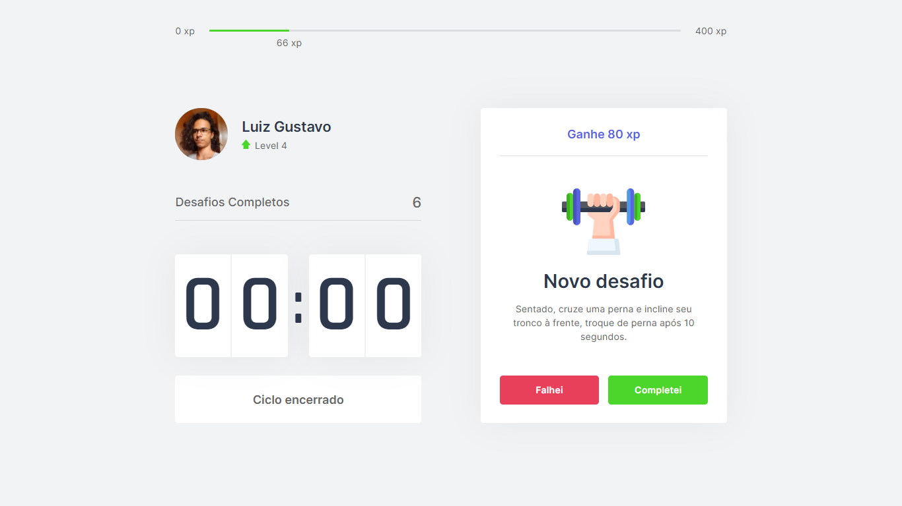

# Move.it

<h1 align="center">
  
</h1>


<h4 align="center"> 
	🚀 NextLevelWeek 4.0 - Move.it
</h4>

<p align="center">
  
</p>

## A Next Level Week

A Next Level Week consiste de um evento prático realizado pela [Rocketseat](https://rocketseat.com.br/), com a finalidade de levar os programadores para o próximo nível por meio de conteúdo aberto para a comunidade.

## 🏃 Iniciando

Primeiro, clone o repositório e acesse a pasta criada:

```bash
git clone https://github.com/iamtheluiz/move.it.git

cd move.it/
```

Dentro da pasta, instale as dependências do projeto:

```bash
npm install
# ou
yarn install
```

## 👨🏽‍💻 Desenvolvimento

```bash
npm run dev
# or
yarn dev
```

Acesse [http://localhost:3000](http://localhost:3000) no seu navegador para acessar o projeto.
